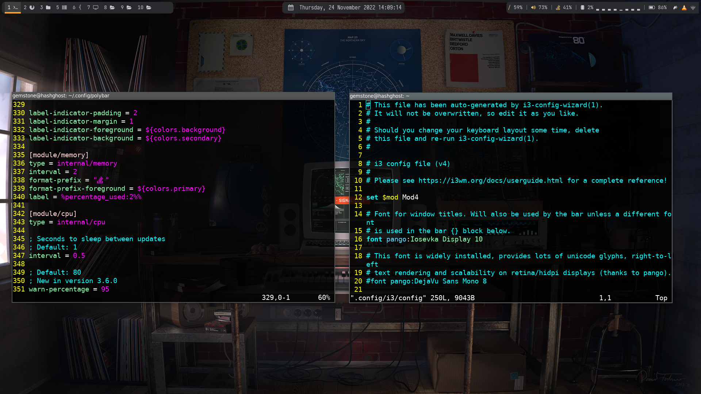

# i3 window manager
This is dotfile configuration for clean installed linux, it has basically aimed to install and configure `i3 window manager environment`, some basics configurations for `vim` and the `.zshrc` for zsh.

This srcipt has been tested on kali linux machine but it can be compatible with all debian family, feel free to customize it the way you like.
## Usage 
Clone this repository and then run the `setup.sh` script or copy the following commands:
```
git clone https://github.com/gemstone-source/kali_config.git
cd kali_config
chmod +x setup.sh 
./setup.sh
```
## Images after configuration


## Note
You can change wallpaper the way you want to and to do so just change this line from `i3/config` to the location where your wallpapers are
```
exec --no-startup-id nitrogen  --set-auto  ~/.config/i3/pictures/06.jpg  --head=0 && nitrogen --set-auto ~/.config/i3/pictures/06.jpg  --head=1
```
Replace `~/.config/i3/pictures/06.jpg ` with your wallpaper path or visit [goatfiles](https://github.com/goatfiles/wallpapers) for wallpapers and use the following script for random wallpapers genration.
```
#!/usr/bin/bash
img=(`find ~/.wallpapers/wallpapers/wallpapers/ -name '*' -exec file {} \; | grep -o -P '^.+: \w+ image' | cut -d':' -f1`)
while true
do
   feh --bg-scale "${img[$RANDOM % ${#img[@]} ]}"
sleep 30m
done
```

Also visit [rofi_advanced](https://github.com/adi1090x/rofi) for more customization of `rofi`

## References.
[rofi_advanced](https://github.com/adi1090x/rofi)

[theme](https://software.opensuse.org/download.html?project=home%3AHorst3180&package=arc-theme)

[fonts](https://github.com/supermarin/YosemiteSanFranciscoFont)

[i3wm_official_site](https://i3wm.org/)

[wallpapers](https://github.com/goatfiles/wallpapers)